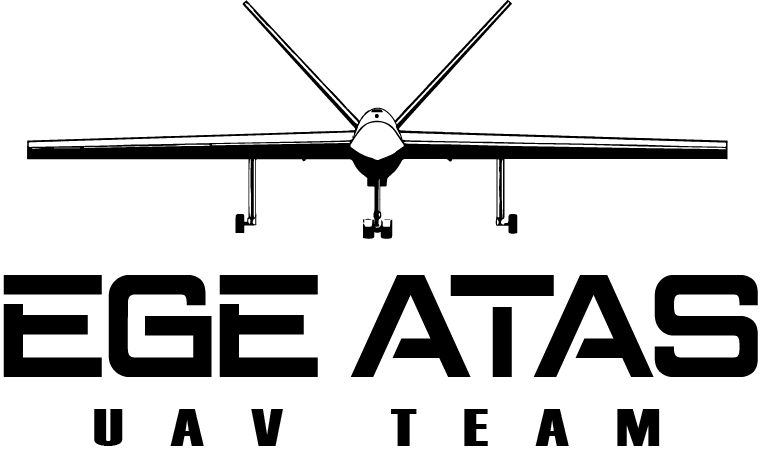

# 👨‍💻 **Hey There! I'm Furkan**  

<div style="display: flex; align-items: center; justify-content: space-between; gap: 15px; flex-wrap: wrap; width: 100%;">
  <div style="flex: 1; min-width: 300px;">
    <ul>
      <li>Software Engineer specializing in Autonomous Systems, API Development, and Full-Stack Web Technologies.</li>
      <li>Passionate about ArduPilot, MAVLink, and UAV software development.</li>
      <li>Currently working on Teknofest UAV &amp; SİHA Competitions as a Software Developer.</li>
      <li>Interested in AI, Computer Vision, and Embedded Systems.</li>
    </ul>
  </div>
</div>

## **🛠 Tech Stack & Skills**


  

### **Programming Languages**


### **Backend & API Development**


### **Databases & Storage**


### **API & Testing Tools**


### **DevOps & Containerization**


### **Monitoring & Logging**


### **Web & Frontend Development**


### **Autonomous Systems & Embedded Development**


### **Game Development & Modding**


### **Operating Systems & Code Editors**


### **Design & Creative Tools**


---
## **🎮 Retired Modder**
**Half-Life & GoldSrc Engine Modding Veteran** 
 
  

---

## **🏆 Achievements & Competitions**
### **🚀 UAV & Autonomous System Development**

  
```
📌 Teknofest 2025 - SİHA & UAV International Competitions  
🔹 Software Engineer at EGE ATAS Team working on autonomous UAVs & control systems  

📌 Teknofest 2024 - SİHA UAV Competition 
🔹 Developed drone software for autonomous UAV control using ROS, MAVLink, and PID algorithms 
🔹 Ranked 22nd in Critical Design Report** with 76.50 points  

📌 Beykoz University - Engineering Project of the Year Awards
🏆 2024: "UAV Tracking System" (Gazebo, ROS, ArduPilot, PyTorch)  
🏆 2023: "Innovative E-Commerce Platform" (Django, PostgreSQL, Cloudinary)  
🏆 2022: "Smart Automation System" (C#, .NET, MS SQL)  
```
---

## **📂 Featured Projects**
🔹 [**E-Commerce Site**](https://github.com/furkanalk/e-commerce-site) - Full-Stack Django-based marketplace  
🔹 [**Restaurant Order & Management System**](https://github.com/furkanalk/restaurant-order-and-management-system)  
🔹 [**Autonomous UAV Control**](https://drive.google.com/file/d/1JXUwvr_YIsbV7Gv-_KE2djEcS9uxYIl9/view?usp=sharing)  

---

## **🎖 Competition Posters**
📌 🏆 **Beykoz University Awards & Teknofest UAV Competitions**  
🔹 **[2024 UAV Tracking System - Poster](https://drive.google.com/file/d/1JXUwvr_YIsbV7Gv-_KE2djEcS9uxYIl9/view?usp=sharing)**  
🔹 **[2023 Innovative E-Commerce - Poster](https://drive.google.com/file/d/1UBO3B8Z_aL3RfUA-bXrGFzWUaYfxo1qJ/view?usp=sharing)**  
🔹 **[2022 Smart Automation System - Poster](https://drive.google.com/file/d/1ueqYe2-CFdOi4WHY4_-TqtMxRNSkPgkF/view?usp=sharing)**  

---

## **📞 Contact**

📧 **furkanalkilic@outlook.com**
---